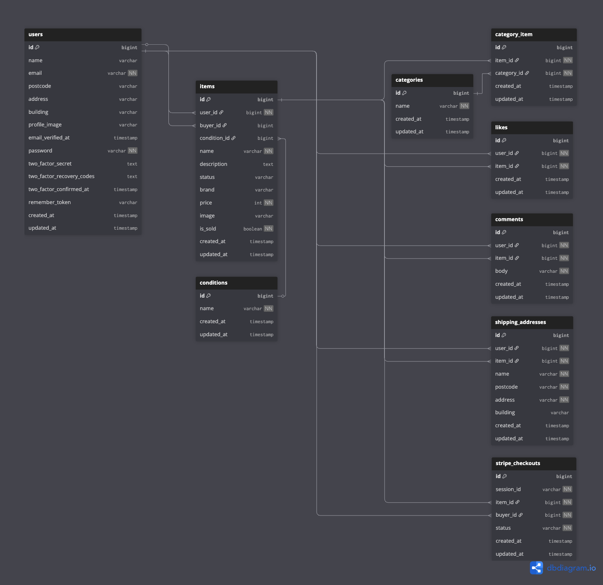

## アプリケーション名

COACHTECH フリマ

---

## アプリケーション概要

独自のフリマアプリとして、アイテムの出品および購入を行うことができる Web アプリケーションです。

ユーザー登録・ログイン機能をはじめ、商品出品、商品購入、いいね・コメント機能、
Stripe を用いた決済機能などを実装しています。

---

## 制作の背景と目的

アイテムの出品と購入を行うためのフリマアプリを開発することを目的としています。  
既存のフリマアプリは機能や画面が複雑で使いづらい点があるため、
シンプルで直感的に操作できるアプリを目指し制作しました。

---

## 制作目標

-   初年度でのユーザー数 1000 人達成

---

## ターゲットユーザー

-   10〜30 代の社会人

---

## 対応ブラウザ・OS

-   PC
    -   Google Chrome 最新版
    -   Firefox 最新版
    -   Safari 最新版

---

## 環境構築

### Docker ビルド

```bash
git clone git@github.com:kekeisz/free-market.git
cd free-market
docker compose up -d --build
```

### Laravel 環境構築

```bash
docker compose exec php bash
composer install
cp .env.example .env
php artisan key:generate
php artisan migrate
php artisan db:seed
```

※ `.env` ファイルの環境変数は開発環境に応じて適宜変更してください。

### 開発環境 URL

-   トップページ：http://localhost/
-   会員登録：http://localhost/register
-   ログイン：http://localhost/login
-   phpMyAdmin：http://localhost:8080

---

## 使用技術

### バックエンド

-   PHP 8.1.33
-   Laravel 8.83.8

### フロントエンド

-   Blade（Laravel）
-   JavaScript（簡単な UI 制御・画像プレビュー等）

### データベース

-   MySQL 8.4.7

### インフラ・開発環境

-   nginx 1.21.1
-   Docker 28.0.4
-   Docker Compose v2

### 外部サービス

-   Stripe API
-   Stripe CLI 1.34.0

---

## ER 図

本アプリで使用しているデータベース構成は以下の通りです。

